# Number Systems and Codes 数制与编码  
## Some lingo  
### Radix 进制  
- binary 二进制
- octal 八进制
- decimal 十进制
- hexadecimal 十六进制
- MSB Most Significant Bit 最高有效位
- LSB Least Significant Bit 最低有效位
### 逻辑门  
- gate 门
- operator 运算符
## Radix-r to Decimal Conversion 任意r进制到十进制转换  
- Integer part 整数部分
  - Multiply by r and add the next digit 乘以r并加上下一个数字
- Fractional part 小数部分
  - Multiply by r and add the next digit 乘以r并加上下一个数字
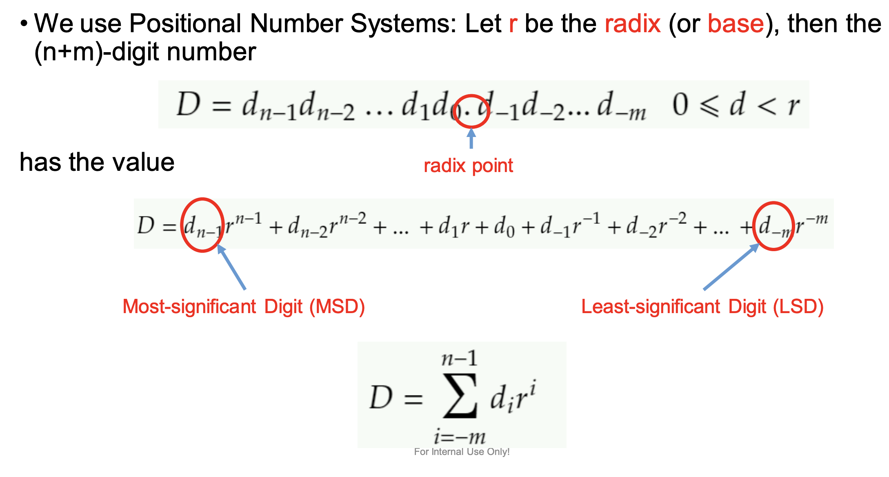
## Decimal to Radix-r Conversion 十进制到任意r进制转换  
- Integer part 整数部分
  - Divide by r and record the remainder 除以r并记录余数
- Fractional part 小数部分
  - Multiply by r and record the integer part 乘以r并记录整数部分
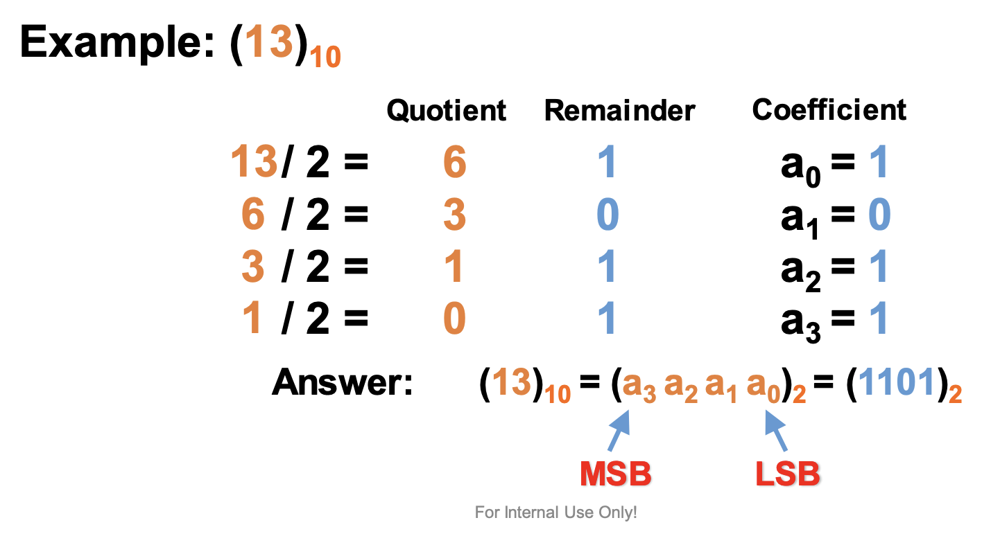
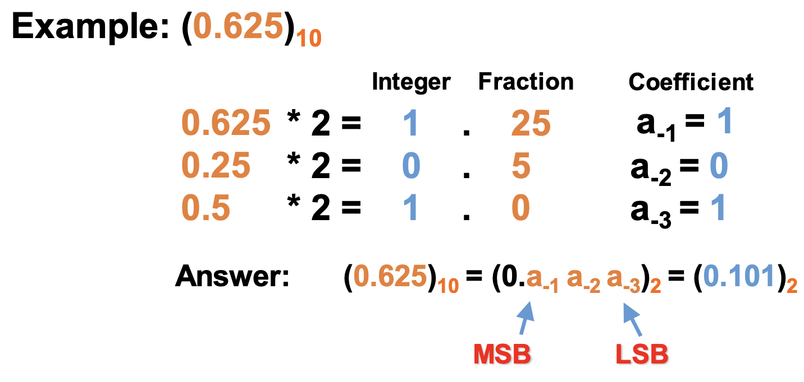
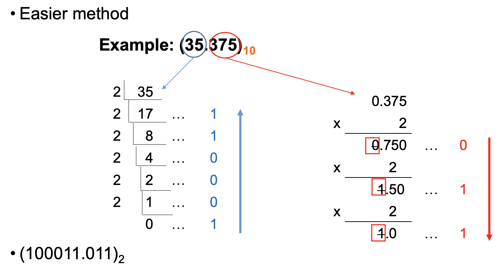

## Radix-r to Radix-s Conversion 任意r进制到任意s进制转换  
- Binary to Octal 二进制到八进制
  - Group binary digits into groups of three 二进制数字分组为三个一组
  - Convert each group to octal 每组转换为八进制
    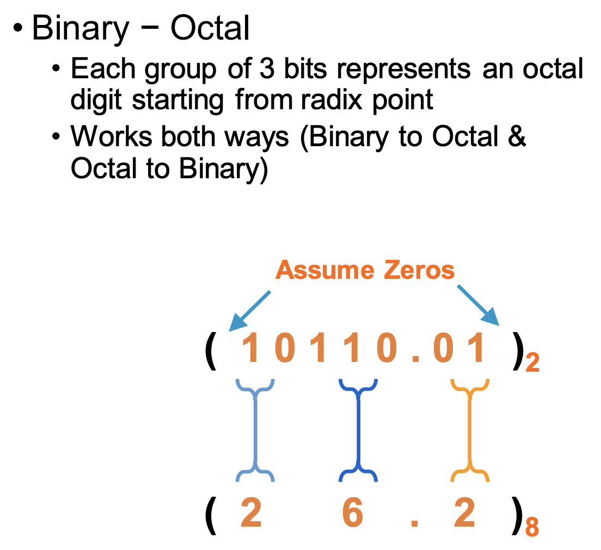
- Binary to Hexadecimal 二进制到十六进制
  - Group binary digits into groups of four 二进制数字分组为四个一组
  - Convert each group to hexadecimal 每组转换为十六进制
  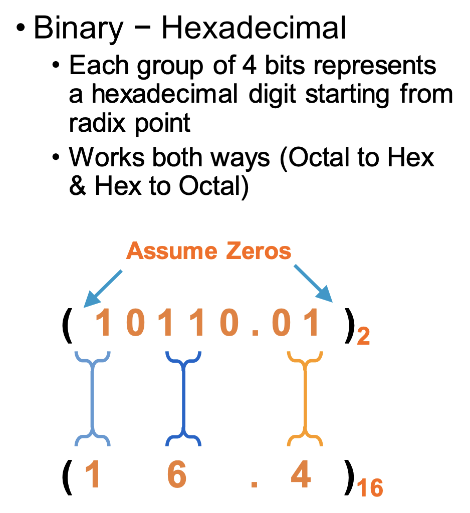
## Common notions  
- Bits 位/位元/比特 
- Byte 字节
  - 1 byte = 8 bits
  - two hexadecimal digit represent one byte value 两个十六进制数字表示一个字节值
    - example: 0x3A = 0011 1010 = 58 
## Complements 补码  
- 为什么要用补码？
    It is hard to design "borrow". So complements are used to implement subtraction.
    - 为了简化减法运算
    - 为了简化电路设计
### Two types of complements 两种补码
1. Disminished radix complement 反码 ((r-1)'s complment)
2. Radix complement 补码 (r's complement)
**For example:**

- For a binary system: 1’s complement and 2’s complement.
- For a decimal system: 9’s complement and 10’s complement.
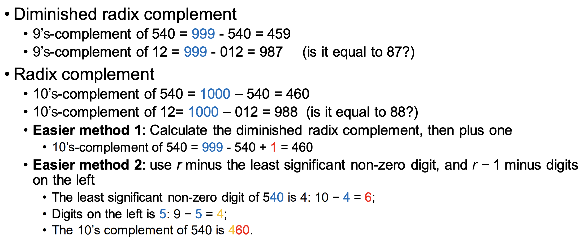
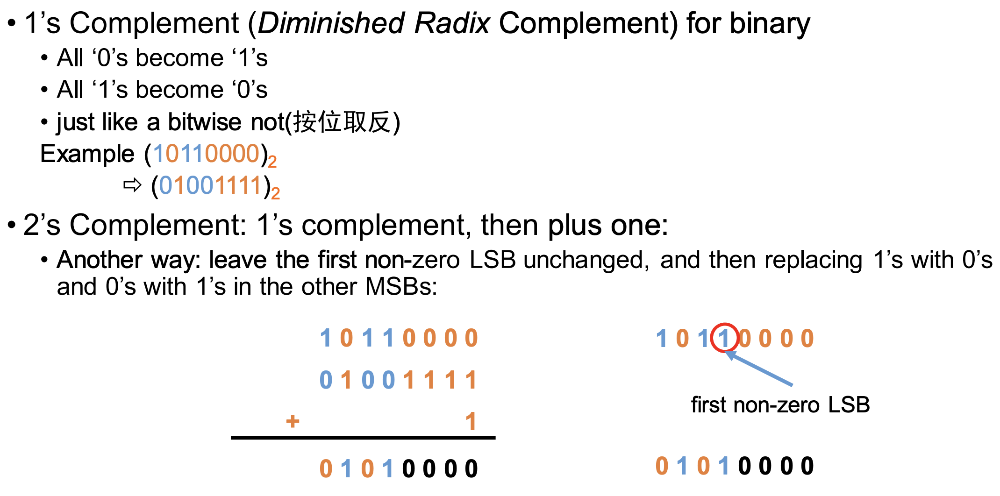
> 2's complement 简单方法：找到最右边的1，将其左边的所有位取反，最右边的1保持不变

### Subtraction with complements 补码减法
- Subtracting a number is equivalent to adding its complement 减去一个数等于加上它的补码
for example: 5-3 = 5+7
步骤：
1.subtraction of two k‐digit unsigned numbers M-N 用无符号的两个k位数相减
2. M-N = M + r's complement of N
   1. if M >= N, the sum will produce an end carry $r^k$ which is discarded, and what is left is the result M – N. 如果M>=N，和会产生一个进位，舍弃掉，剩下的就是结果
   2. if M < N, the sum will equal to the $r^k$ complement of M-N 如果M<N,那么就不会有carry，和就是M-N的补码
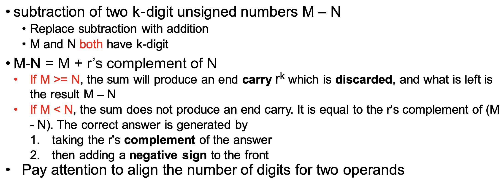
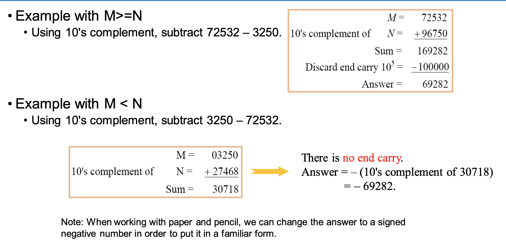

### Signed Binary Numbers
- Three types of representations of signed binary numbers:
  - Sign-magnitude representation
  - Signed-1’s complement representation
  - Signed-2’s complement representation

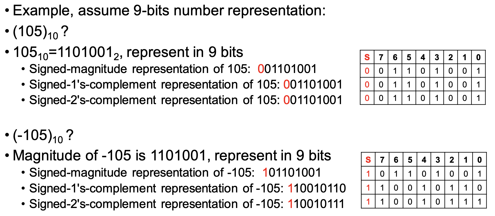
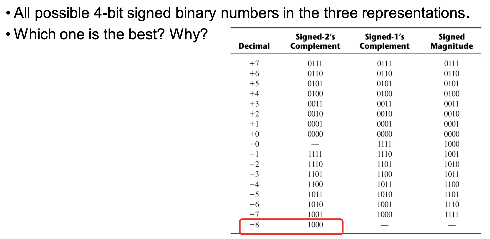